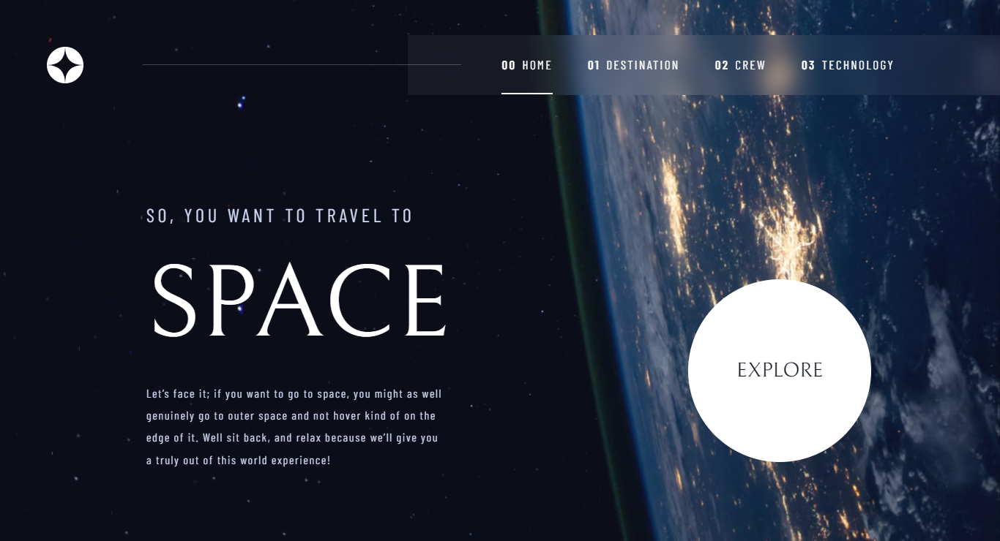
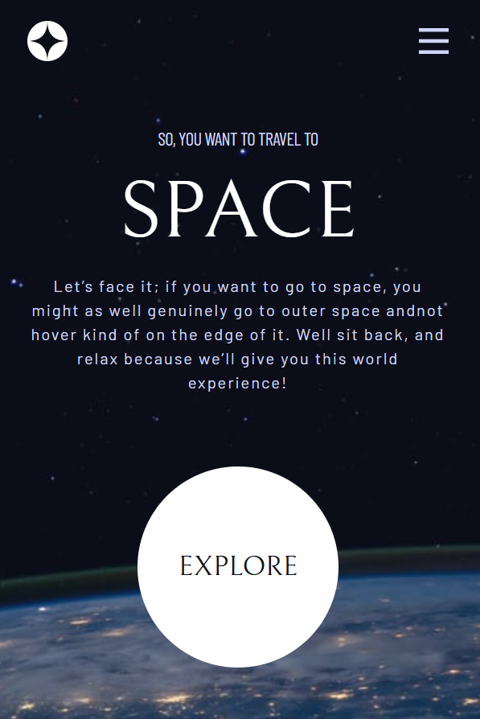

# Frontend Mentor - Space Tourism Website

This is a Space Tourist Website from Frontend Mentor challenges which help me improve my coding skills built with React

## Table of contents

- [Screenshot](#screenshot)
- [Links](#links)
- [Built with](#built-with)

## Screenshot

                This is a desktop View.
                 

                 This is a mobile view.
                 
  

   
  

  
### Links

- [Demo](https://space-tourism-react-gamma.vercel.app)

### Built with

- Tailwind CSS
- [React](https://reactjs.org/) - JS library
- React Router
